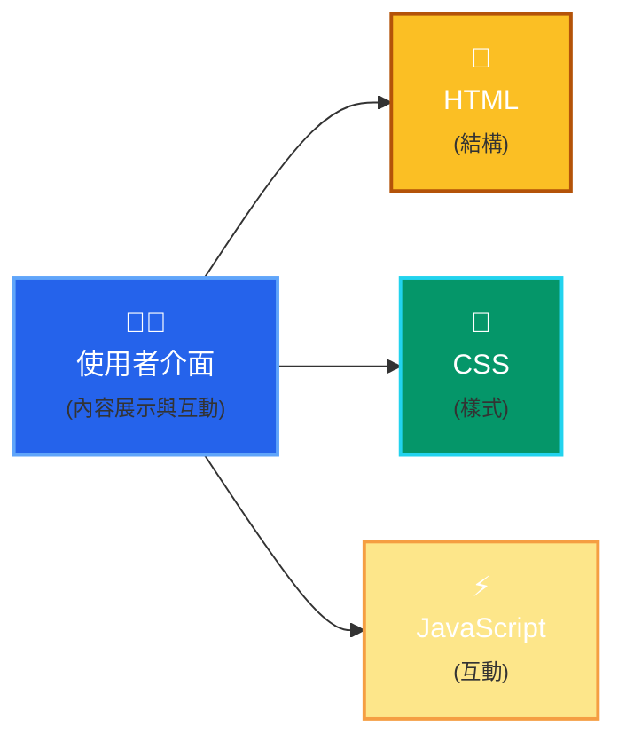
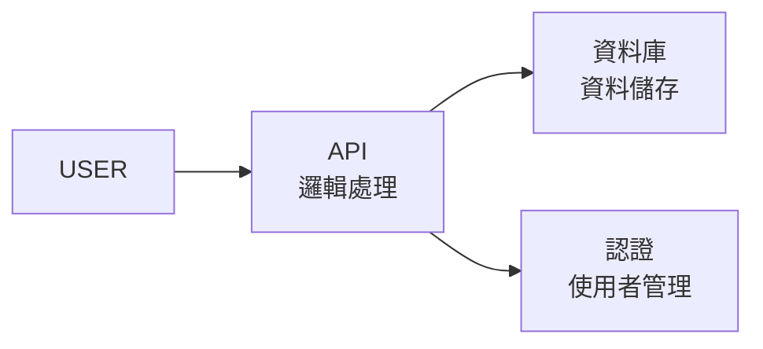

<LoadingScene
  title="Vibe Coding 工作坊"
  subtitle="生成、部屬、資料庫的 0-1 實戰工作坊"
  quote="Calpa Liu"
/>

---
layout: two-cols
class: flex flex-col h-full justify-center items-center gap-4
---

- 💻 熟悉 TypeScript, React, Node.js, Solidity
- 🛠️ 曾任職多家科技公司全端工程師
- 🥈 ETHGlobal Taipei 2025 1inch 賽道銀獎
- ChatGPT, Windsurf, Bolt.new 等 AI 工具重度使用者

::right::


<div class="text-xl font-bold">Calpa Liu</div>

---
layout: two-cols
layoutClass: gap-4 bg-[#172966]
class: flex flex-col h-full justify-center gap-4 text-white
---

## 技術博客

- 持續分享前端、後端與 Web3 技術文章與實作心得，涵蓋 Astro、React.js、TypeScript 等主題
- 2025 年 3 月中開始每日一篇鐵人賽
- 2017 起累積 276 篇文章

<div class="text-blue-400">https://calpa.me/</div>

::right::


---
layout: two-cols
layoutClass: gap-4
class: flex flex-col h-full justify-center gap-4
---

## OrbitGO

- 🥈 榮獲 ETHGlobal Taipei 2025 黑客松 1inch 賽道第二名
- 整合 1inch Portfolio API，實作多鏈資產查詢與視覺化介面

<div class="text-blue-400">https://orbitgo.calpa.me/</div>

::right::


---
layout: two-cols
layoutClass: gap-4
class: flex flex-col h-full justify-center gap-4
---

## Urusai

你的數位噪音保護罩

- 📦 Github 76 ⭐️
- 利用隨機 HTTP/DNS 請求產生流量噪音
- 保護用戶瀏覽隱私，支援多平台與自定義規則
- 對抗網路監控的輕量級隱私工具
- 使用 Go 語言開發

<div class="text-blue-400">https://github.com/calpa/urusai</div>

::right::


---
layout: center
class: bg-[#172966] text-white
---

# 網站是如何運作的？

---
layout: center
---

## 前端



---
layout: center
---

## 伺服器端



---
class: flex flex-col h-full justify-center items-center gap-4
---

<SDLC />

---
layout: center
class: bg-[#172966] text-white
---

# 現代網頁開發新選擇

---
layout: two-cols
class: flex flex-col h-full justify-center gap-4
---

## Astro

- 現代化的網站開發框架
- 採用「島嶼式」架構，提升效能
- 頁面載入速度極快，體驗流暢
- 支援多種主流前端技術（如 React、Vue 等）

::right::


---
layout: center
---

## Supabase

- 開放原始碼的雲端資料庫平台
- 提供即時同步功能
- 內建用戶認證與授權
- 提供簡潔易用的 API，方便前後端整合

---
layout: center
---

## Drizzle ORM

- 型別安全的 TypeScript ORM，讓你用程式碼定義資料表結構
- 支援多種資料庫（Postgres、MySQL、SQLite 等）
- 編譯時自動產生 SQL，避免手寫錯誤
- 整合 Migration、Schema、型別推斷，開發更安心

---

## 實作示範：建立部落格

1. 建立 Astro 專案
2. 設計資料庫結構
3. 整合 Supabase
4. 實作 CRUD 功能
5. 部署上線

<div class="text-blue-400">讓我們開始吧！</div>

---
layout: center
class: bg-[#172966] text-white
---

# 1. 建立 Astro 專案

```bash
# 建立新專案
npm create astro@latest my-astro-blog

# 進入專案目錄
cd my-astro-blog

# 安裝依賴
npm install

# 啟動開發伺服器
npm run dev
```

---
layout: center
class: bg-[#172966] text-white
---

# 2. 設定 Supabase

1. 前往 [Supabase](https://supabase.com/) 註冊帳號
2. 建立新專案
3. 取得 API 金鑰和專案 URL
4. 安裝 Supabase 客戶端

```bash
npm install @supabase/supabase-js
```

---

## 3. 設計資料庫

```ts
// 使用 Drizzle ORM 定義 posts 資料表
import { pgTable, serial, text, timestamp } from 'drizzle-orm/pg-core'

export const posts = pgTable('posts', {
  id: serial('id').primaryKey(),
  title: text('title').notNull(),
  content: text('content'),
  createdAt: timestamp('created_at', { withTimezone: true }).defaultNow(),
  updatedAt: timestamp('updated_at', { withTimezone: true }).defaultNow(),
})
```

---

## 4. 環境變數設定

在 `.env` 檔案中：

```txt
PUBLIC_SUPABASE_URL=你的專案URL
PUBLIC_SUPABASE_ANON_KEY=你的公開金鑰
```

---
layout: center
class: bg-[#172966] text-white
---

# 5. 實作 CRUD 功能

1. 初始化 Supabase 客戶端
2. 實作文章列表
3. 新增/編輯/刪除文章
4. 即時更新

---
layout: center
class: bg-[#172966] text-white
---

# 6. 部署上線

1. 推送到 GitHub 儲存庫
2. 登入 Zeabur
3. 匯入專案
4. 設定環境變數
5. 部署！

---
layout: center
class: bg-[#172966] text-white
---

# 學習資源

- [Astro 官方文件](https://docs.astro.com/)
- [Supabase 官方文件](https://supabase.com/docs)
- [GitHub 範例專案](https://github.com/yourusername/astro-supabase-blog)
- [我的技術部落格](https://calpa.me/)

---
layout: center
class: bg-[#172966] text-white
---

# Q & A

有任何問題嗎？

---
layout: two-cols
layoutClass: gap-4
class: flex flex-col h-full justify-center gap-4
---

## 接下來的計畫

- 1/6 台北《AI 煉金術》實體分享會

::right::


---

## 📍 6/1（台北）｜《AI 煉金術》實體分享會
從靈感到 Side Project，用 AI 工具煉出你的創作流程。

工具包含 ChatGPT、Firecrawl、Notion 等

分享我從 prompt → 文章 → 產品的完整流程

📅 時間：6/1（週日）15:00 – 18:00

📍 地點：台北捷運站附近

👥 已報名人數：17 / 30 人

🆓 免費參加

📌 報名表單：
👉 https://go.calpa.me/2025-06-01

---

## 謝謝大家


- 🎯 今天，我們完成了從需求分析到報名系統的一條龍自動化流程
- 📩 有問題歡迎私訊，我會在 Discord 回應大家的提問！
